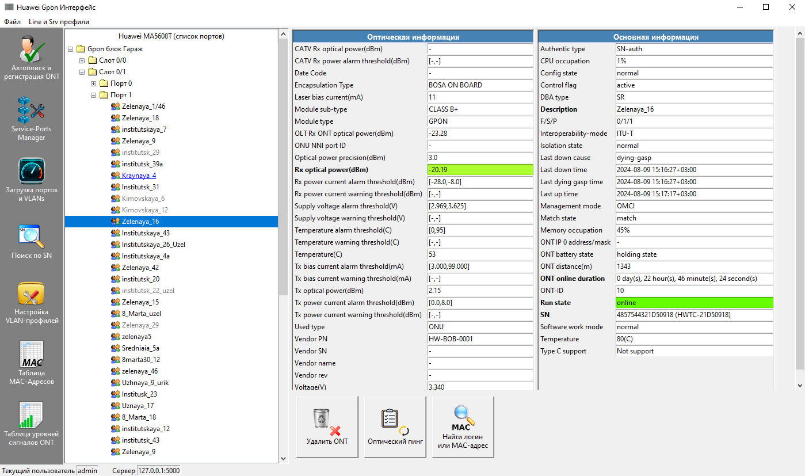
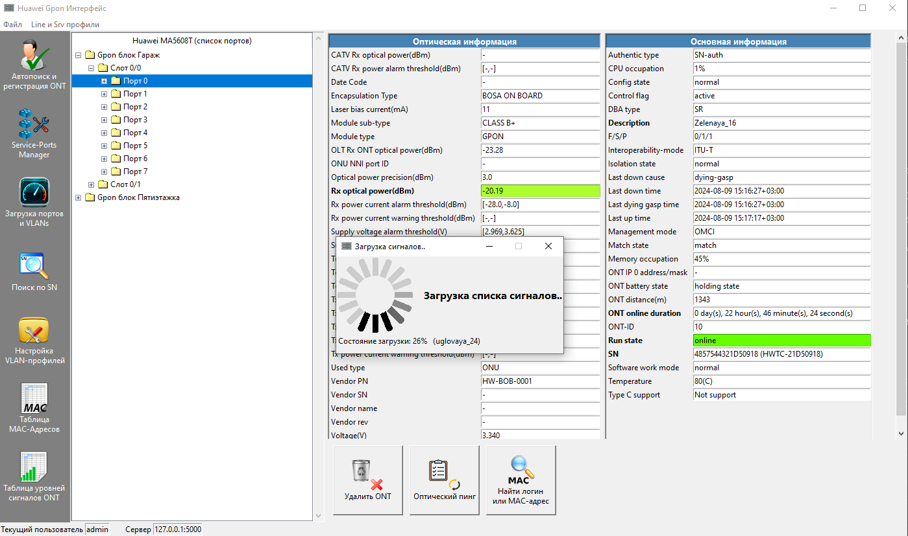
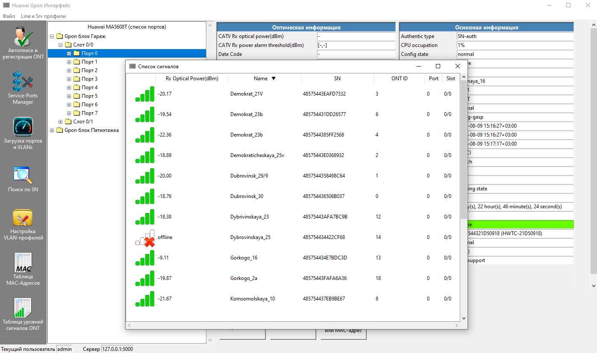
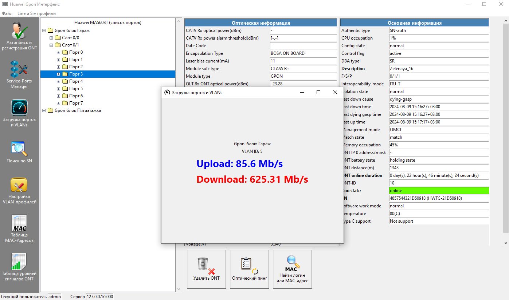

# Gpon_interface_v2
### Продолжение разработки Gui для Gpon-блока
Первая версия [Gpon_interface_v1](https://github.com/sita8281/Gpon_interface_v1)<br>
Данный проект создавался примерно в 2020-2021 году


### Основные дополнения
* Клиент-серверная архитектура (HTTP)
* Добавлен multithreading (для отзывчивости Gui)
* Улучшен дизайн
* Расширен функционал


### Серверная часть
* Основана на Flask
* Запросы к Gpon-блоку реализованы через paramiko
* Репозиторий серверной части [Gpon_api_flask_v2
](https://github.com/sita8281/Gpon_api_flask_v2)

### Установка
#### Установить Tkinter (если не установлен по умолчанию)
Клонируем
``` 
git clone https://github.com/sita8281/Gpon_interface_v2.git
```

Ставим окружение
```
cd Gpon_interface_v2
python -m venv venv
```

Активируем env (linux)
```
source venv\bin\activate
```

Активируем env (windows)
```
venv\scripts\activate.bat
```

Устанавливаем библиотеки
```
pip install -r requirements.txt
```

Устанавливаем библиотеки
```
pip install -r requirements.txt
```

Запуск
```
python main.py
```

# Demo






